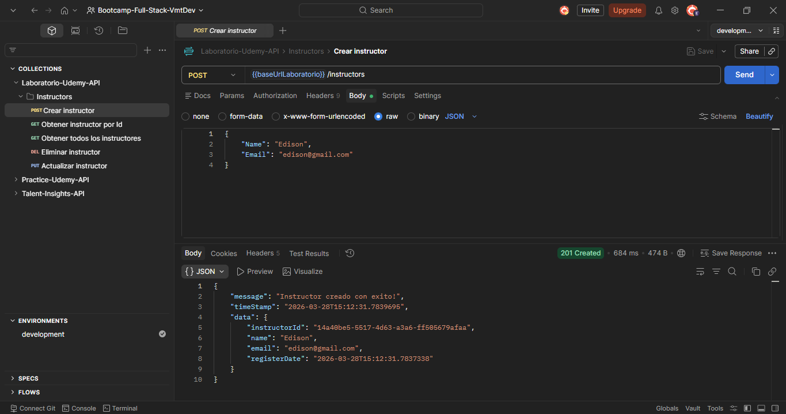
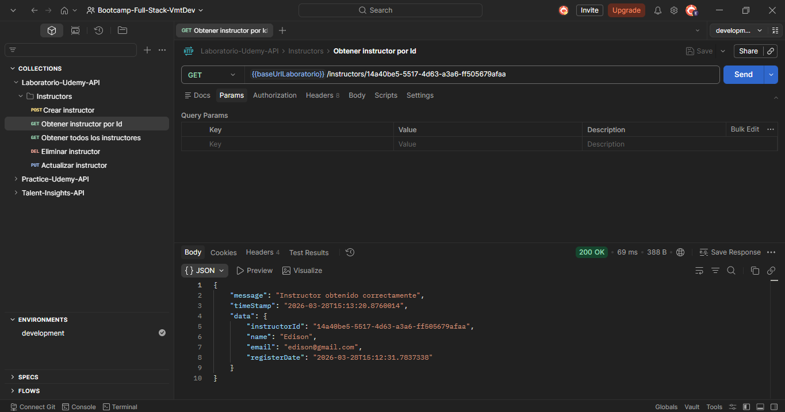
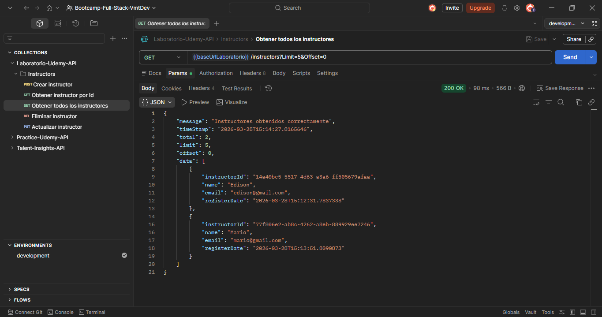
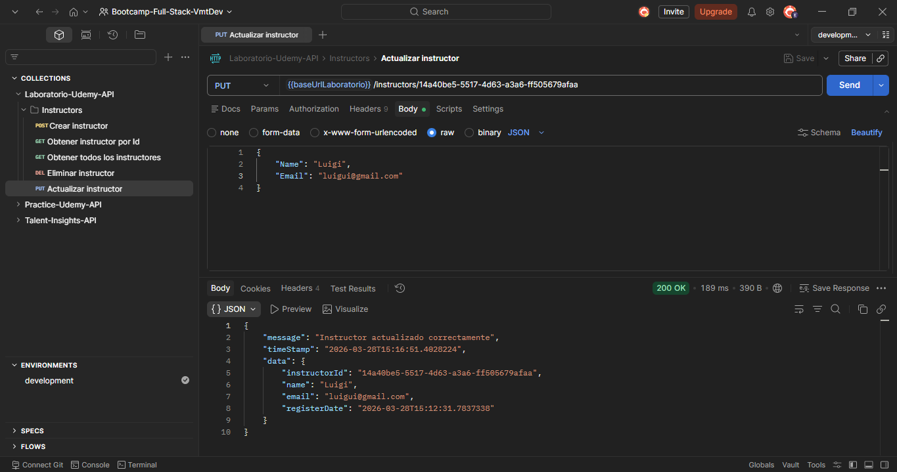
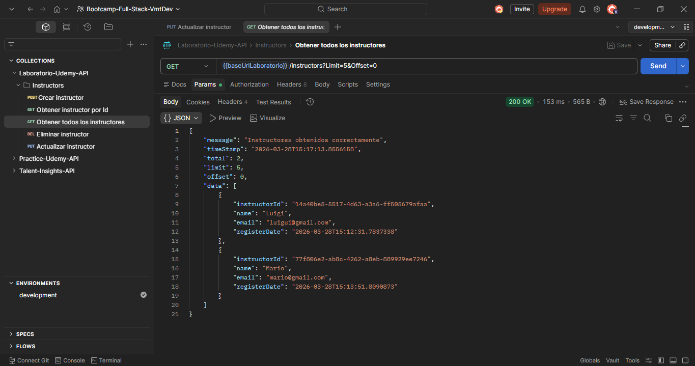
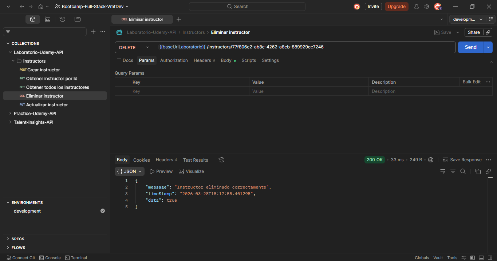
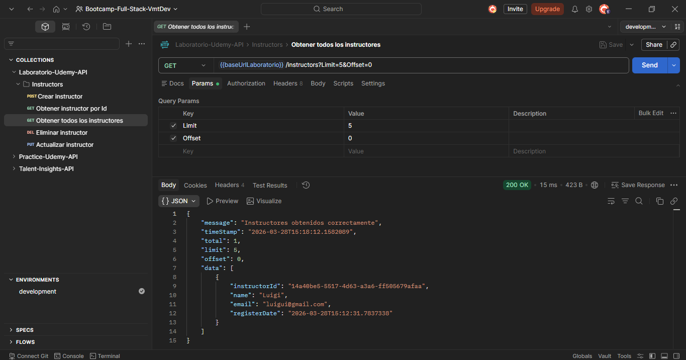

# 🚀 Laboratorio Udemy

<p align="center">
  
  
  
</p>

## 📌 Descripción

**Laboratorio Udemy** es una API desarrollada con **ASP.NET Core Web Api**, diseñada para gestionar instructores mediante operaciones CRUD.

El proyecto implementa principios de **arquitectura limpia**, separación de responsabilidades y uso de **inyección de dependencias**, utilizando almacenamiento en memoria como mecanismo de persistencia temporal.

## 🧱 Arquitectura

El proyecto está organizado en capas siguiendo buenas prácticas:

```
LaboratorioUdemy
│
├── WebApi              → Exposición HTTP (Controllers, configuración)
├── Application         → Lógica de negocio
│   ├── Services
│   ├── DTOs
│   ├── Requests
│   └── Responses
├── Shared              → Utilidades y helpers
│   ├── Cache
│   └── Helpers
```

## ⚙️ Tecnologías

- .NET 9
- ASP.NET Core Web API  
- C#  
- Dependency Injection  
- LINQ  
- In-Memory Cache (Dictionary)  

## 📌 Endpoints

### ➕ Crear Instructor

**POST** `/api/instructors`

```json
{
  "name": "Edison Salinas",
  "email": "esalinas@email.com"
}
```

### 🔍 Obtener por ID

**GET** `/api/instructors/{id}`

### 📋 Listar Instructores

**GET** `/api/instructors?limit=10&offset=0`

### ✏️ Actualizar Instructor

**PUT** `/api/instructors/{id}`

```json
{
  "name": "Nuevo Nombre",
  "email": "nuevo@email.com"
}
```

### ❌ Eliminar Instructor

**DELETE** `/api/instructors/{id}`

## 📦 Formato de Respuestas

### ✅ Respuesta estándar

```json
{
  "message": "string",
  "timeStamp": "2025-01-01T00:00:00",
  "data": {}
}
```

### 📄 Respuesta paginada

```json
{
  "message": "string",
  "timeStamp": "2025-01-01T00:00:00",
  "total": 10,
  "limit": 5,
  "offset": 0,
  "data": []
}
```

## 🧪 Pruebas de API (Postman)

> [!IMPORTANT]
> Las imágenes corresponden a pruebas realizadas en entorno local.

A continuación se muestran evidencias de las operaciones CRUD realizadas sobre el recurso **Instructors** utilizando Postman.

### ➕ Crear Instructor

Se registra un nuevo instructor en el sistema.



### 🔍 Obtener Instructor por ID

Consulta de un instructor específico mediante su identificador único.



### 📋 Listar Instructores

Obtención de todos los instructores con paginación.



### ✏️ Actualizar Instructor

Actualización de los datos de un instructor existente.

**Resultado de la actualización:**



**Verificación posterior:**



### ❌ Eliminar Instructor

Eliminación de un instructor del sistema.

**Resultado de la eliminación:**



**Verificación posterior:**

